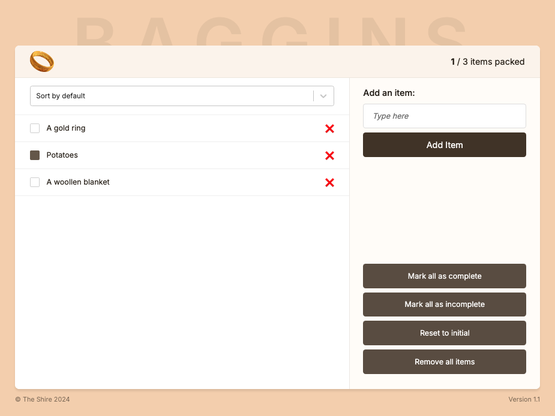

## Goal

To create an app that allows a user to create and update a to-do list using the Zustand and React-select libraries.

## Build

The app was created using TypeScript and React.js.

In order to save details to local storage and make use of Zustand for shared state management, I implemented the following code:

``` JavaScript
addItem: (newItemText: string) => {
        const newItem: ItemsType = {
          id: Date.now(), // ! Future action
          item: newItemText,
          packed: false,
        };
        set((state) => {
          return { items: [...state.items, newItem] };
        });
      }
```
Having first implemented local storage without the use of Zustand, once I'd got used to the syntax of setting up the other elements in Zustand, it was quite easy to add the `persist` feature through Zustand-middleware.

```JavaScript
export const useItemsStore = create(
  persist(
    (set) => ({ ...
```
This could then be easily added where necessary in the app, for example, when an item has to be deleted in ItemList > Item all I had to do was:

1. Import the function: `const deleteItem = useItemsStore((state) => state.deleteItem)`
2. Apply it to each mapped item and delete using the item's id: `<button onChange={() => handleDeleteItem(id)}> ... `

Using Zustand was an interesting way of solving the issue of useContext re-rendering everything when one element updated. I'll definitely be using it again for this purpose.

## Future Improvements

### ID
For each item, the ID is currently created using the `Date.now()` class which could potentially produce duplicate keys. I could improve this system by adding something to make the identifier more unique, for example concatenating the unix date with the item name.

## Screenshots



## Technologies and Dependencies

#### Front-end

- JavaScript
- TypeScript
- Zustand
- React
- React-Select
- HTML
- CSS

#### Development Tools

- VS Code
- Git
- Github
- Chrome DevTools
